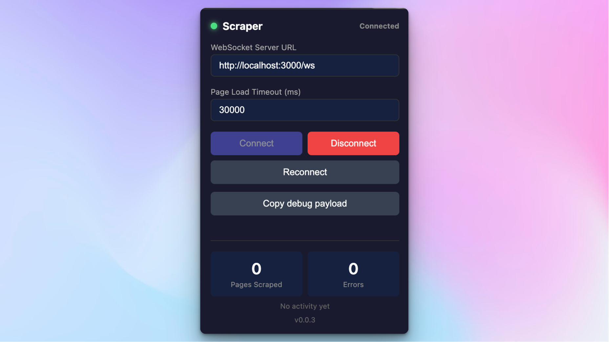

# Scraping Controller Chrome Extension



Chrome extension for remote-controlled web scraping via HTTP API. Opens pages in Chrome and returns HTML content including Shadow DOM.

```
┌─────────────────────────────────────────────────────────────────────────────┐
│                                  CHROME                                      │
│  ┌─────────────────┐                                                        │
│  │    Extension    │                                                        │
│  │   (popup.js +   │    Chrome Native                                       │
│  │  background.js) │    Messaging API                                       │
│  └────────┬────────┘       (stdio)                                          │
│           │                                                                 │
└───────────┼─────────────────────────────────────────────────────────────────┘
            │
            ▼
┌───────────────────────┐         ┌─────────────────────────┐
│     Native Host       │         │     HTTP Clients        │
│      (Node.js)        │◄────────│  (curl, your server,    │
│                       │  HTTP   │   API consumers, etc.)  │
│  - Runs as separate   │  POST   │                         │
│    process            │ /scrape └─────────────────────────┘
│  - Hono HTTP server   │
│  - Port 3002 default  │
└───────────────────────┘
```

## Data Flow

1. HTTP client sends POST /scrape → Native Host
2. Native Host forwards SCRAPE command → Extension (via stdio)
3. Extension opens tab, captures content
4. Extension sends RESULT → Native Host (via stdio)
5. Native Host returns HTTP response → Client

## Installation

### 1. Load Extension

1. Go to `chrome://extensions/`
2. Enable **Developer mode** (top right toggle)
3. Click **Load unpacked**
4. Select this directory

### 2. Get Extension ID

After loading, copy the **ID** shown under "Scraping Controller" (32-character string like `cigpoehhihgofakjfekijajiafildcap`)

### 3. Install Native Host

```bash
cd native-host
pnpm install
./install.sh YOUR_EXTENSION_ID
```

### 4. Reload & Connect

1. Go to `chrome://extensions/`
2. Click the **refresh icon** on "Scraping Controller"
3. Click extension icon in toolbar
4. Click **Connect**

## HTTP API

### POST /scrape

Scrape a URL and return the HTML content.

**Request:**
```bash
curl -X POST http://localhost:3002/scrape \
  -H "Content-Type: application/json" \
  -d '{"url": "https://example.com"}'
```

**Request with options:**
```bash
curl -X POST http://localhost:3002/scrape \
  -H "Content-Type: application/json" \
  -d '{
    "url": "https://example.com",
    "options": {
      "waitFor": 2000,
      "timeout": 30000
    }
  }'
```

**Response (success):**
```json
{
  "html": "<!DOCTYPE html>...",
  "status_code": 200,
  "content_size": 12345,
  "final_url": "https://example.com/after-redirect"
}
```

**Response (error):**
```json
{
  "error": "Page load timeout",
  "status_code": 0,
  "content_size": 0,
  "final_url": "https://example.com"
}
```

### GET /health

Check if the native host is running.

**Request:**
```bash
curl http://localhost:3002/health
```

**Response:**
```json
{
  "status": "ok",
  "pending": 0,
  "timestamp": "2025-01-01T12:00:00.000Z"
}
```

## Configuration

### Native Host

| Setting | Default | Description |
|---------|---------|-------------|
| `SCRAPER_PORT` | `3002` | HTTP server port (environment variable) |

### Extension (chrome.storage.local)

Stored under key `scraperConfig`:

| Setting | Default | Description |
|---------|---------|-------------|
| `enabled` | `false` | Whether connection is active |
| `pageLoadTimeout` | `30000` | Max time to wait for page load (ms) |

## Files

| File | Purpose |
|------|---------|
| `manifest.json` | Chrome extension manifest (v3) |
| `background.js` | Service worker - communicates with native host, manages tabs |
| `popup.html` | Extension popup UI |
| `popup.js` | Popup logic and state management |
| `native-host/` | Native messaging host (Node.js + Hono HTTP server) |

## Debugging

**Extension logs:**
1. Go to `chrome://extensions/`
2. Click "Inspect views: service worker"
3. Check Console tab

**Native host logs:**
```bash
tail -f /tmp/scraper-native-host.log
```

**Test the API:**
```bash
# Health check
curl http://localhost:3002/health

# Scrape a page
curl -X POST http://localhost:3002/scrape \
  -H "Content-Type: application/json" \
  -d '{"url": "https://example.com"}'
```

## Uninstall Native Host

```bash
cd native-host
./uninstall.sh
```

## Usage Examples

### Node.js client

```javascript
async function scrape(url, options = {}) {
  const response = await fetch('http://localhost:3002/scrape', {
    method: 'POST',
    headers: { 'Content-Type': 'application/json' },
    body: JSON.stringify({ url, options }),
  });

  const result = await response.json();

  if (result.error) {
    throw new Error(result.error);
  }

  return result;
}

// Usage
const result = await scrape('https://example.com');
console.log('HTML length:', result.html.length);
console.log('Final URL:', result.final_url);
console.log('Status:', result.status_code);
```

### Python client

```python
import requests

def scrape(url, wait_for=None, timeout=None):
    options = {}
    if wait_for:
        options['waitFor'] = wait_for
    if timeout:
        options['timeout'] = timeout

    response = requests.post(
        'http://localhost:3002/scrape',
        json={'url': url, 'options': options}
    )

    result = response.json()

    if 'error' in result:
        raise Exception(result['error'])

    return result

# Usage
result = scrape('https://example.com')
print(f"HTML length: {len(result['html'])}")
print(f"Final URL: {result['final_url']}")
print(f"Status: {result['status_code']}")
```

## Requirements

- Node.js 18+
- Chrome or Chromium browser
- pnpm (for native host installation)

## Why Native Messaging Host?

Chrome's Manifest V3 terminates extension background scripts after ~30 seconds of inactivity. The Native Messaging Host runs as a separate Node.js process that Chrome cannot terminate, keeping the HTTP server alive and bridging requests to the extension via stdio.

## Permissions

The extension requires these permissions:
- `tabs` - Open and manage browser tabs
- `activeTab` - Access the active tab
- `scripting` - Inject content scripts to capture page content
- `storage` - Store configuration
- `webRequest` - Capture HTTP status codes
- `nativeMessaging` - Communicate with the native host
- `<all_urls>` - Access any URL for scraping
